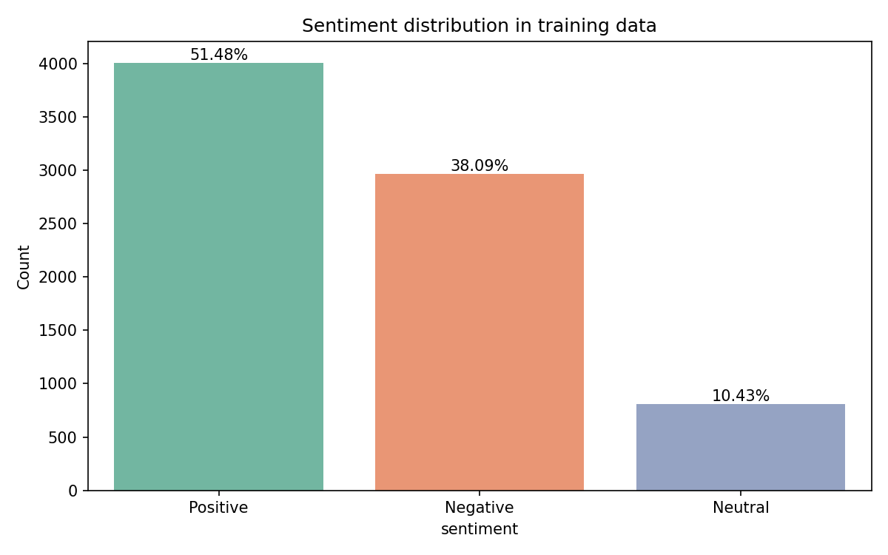
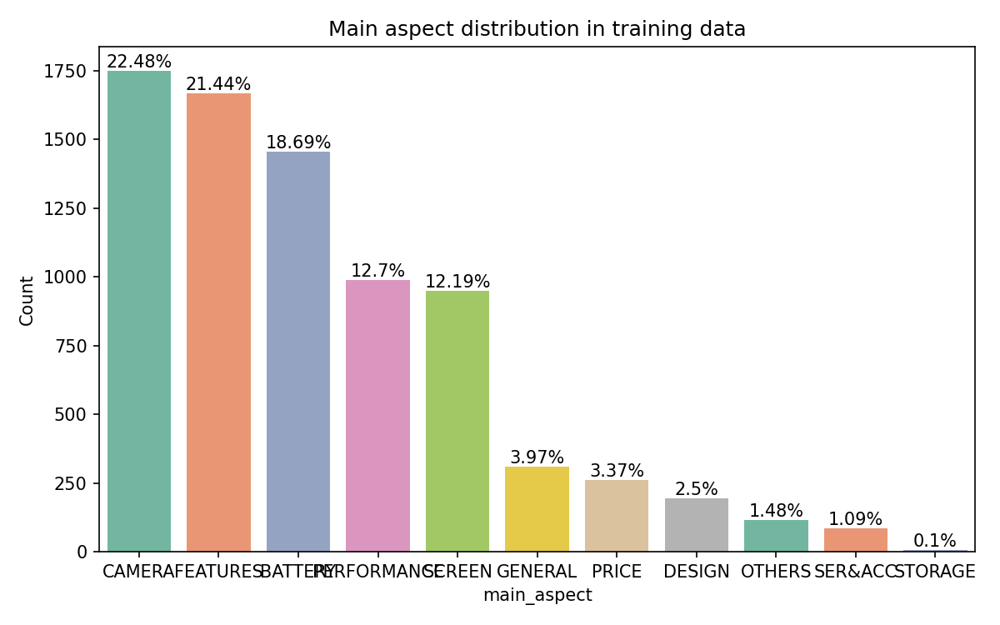
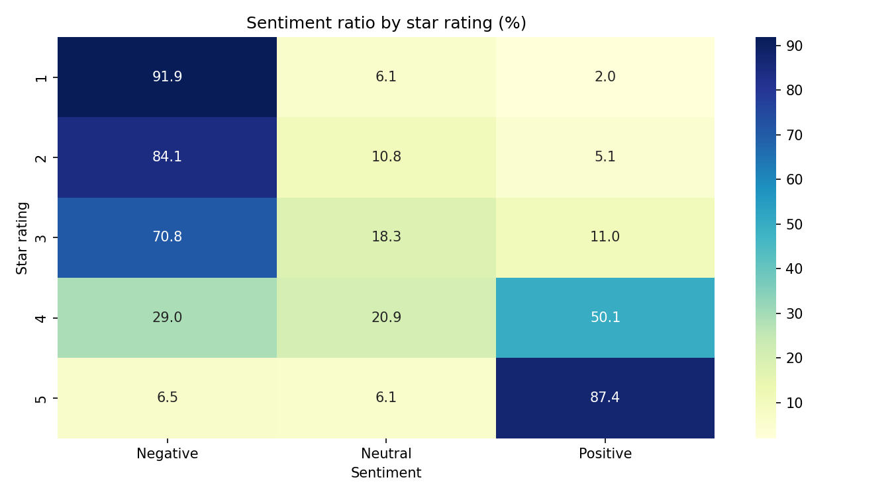
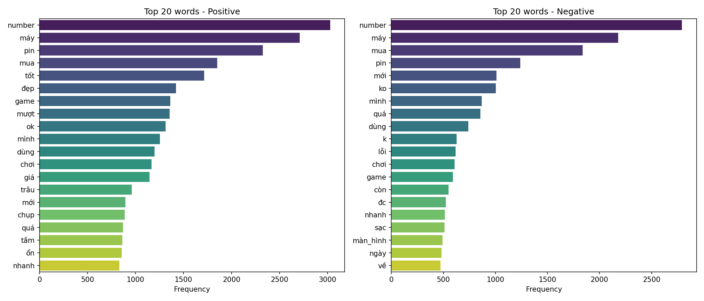
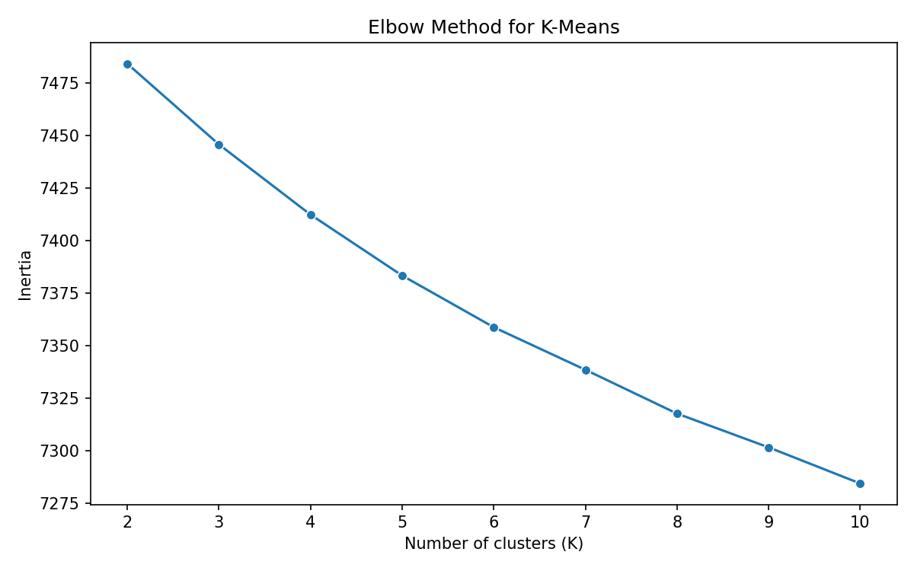
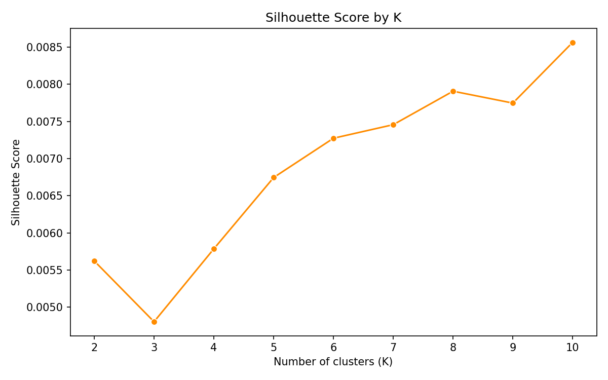
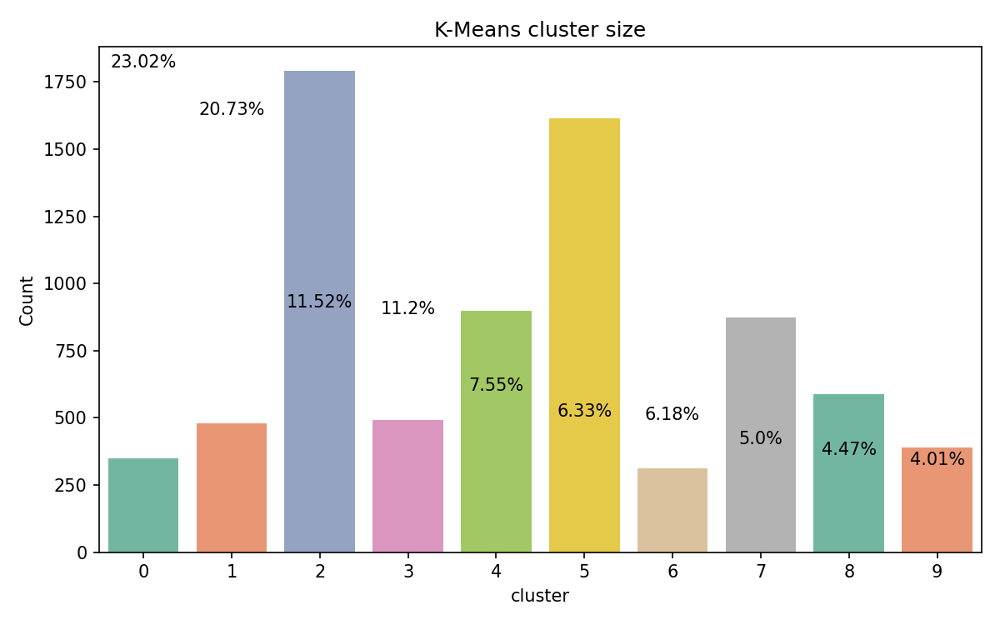
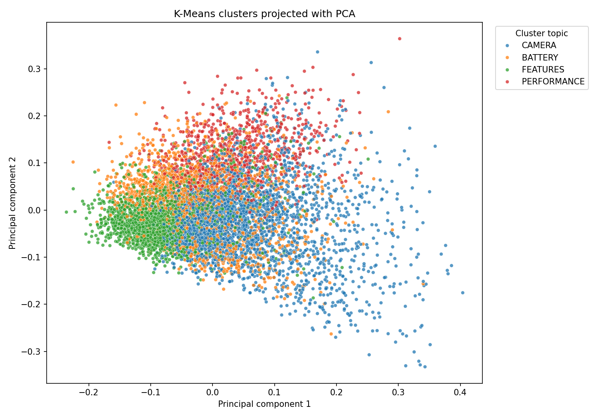
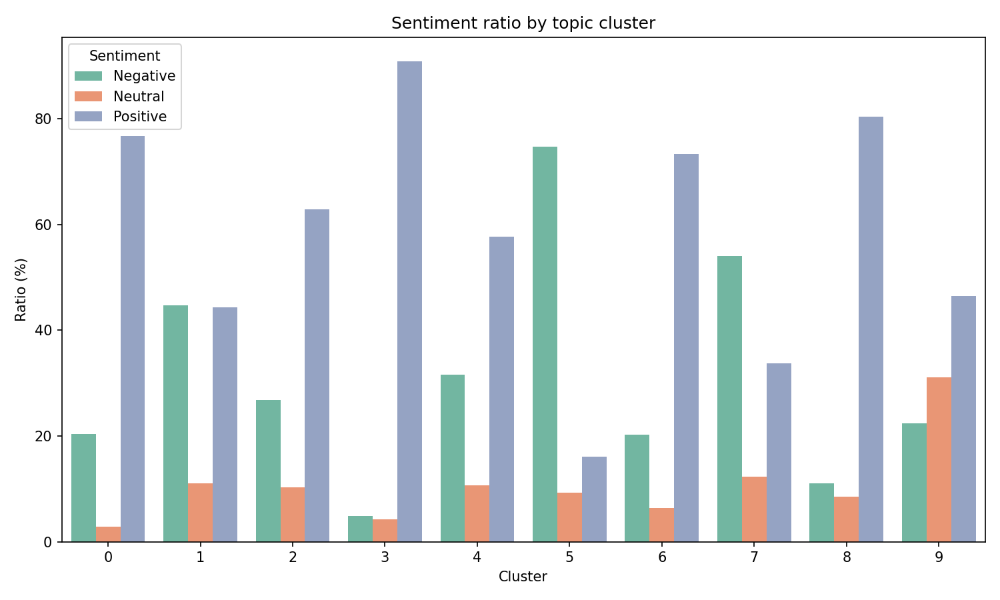
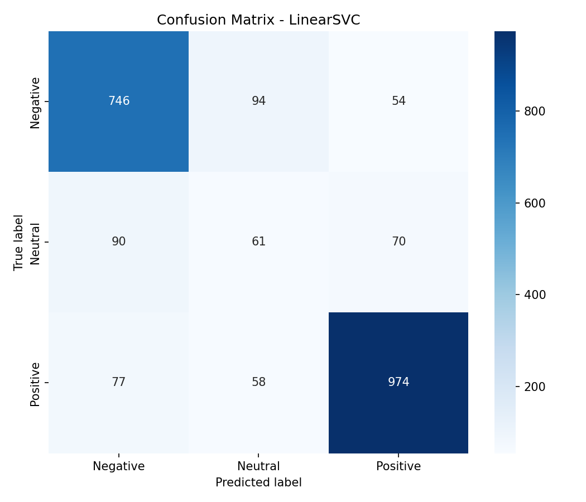

# Phân cụm chủ đề và phân tích cảm xúc bình luận điện thoại tiếng Việt

## 1. Tổng quan

Dự án này khai phá dữ liệu bình luận điện thoại tiếng Việt từ bộ dữ liệu UIT-ViSFD. Pipeline kết hợp hai hướng:

- **K-Means clustering** để gom bình luận thành các cụm chủ đề dựa trên TF-IDF.
- **LinearSVC sentiment classification** để phân loại cảm xúc tổng thể thành `Positive`, `Negative`, `Neutral`.

Notebook dùng để trình bày và phân tích từng bước. Các file `.py` trong `src/` giữ phần logic lõi để tái sử dụng, test và chạy toàn bộ pipeline bằng `python main.py`.

## 2. Dữ liệu

Nguồn dữ liệu: [UIT-ViSFD](https://github.com/LuongPhan/UIT-ViSFD)

| Tập dữ liệu | Đường dẫn | Số mẫu |
|---|---|---:|
| Train | `datasets/raw/Train.csv` | 7,786 |
| Test | `datasets/raw/Test.csv` | 2,224 |

Mỗi dòng gồm nội dung bình luận, số sao, thời gian và nhãn aspect-based dạng:

```text
{CAMERA#Positive};{BATTERY#Negative};{PRICE#Neutral};
```

Các aspect chính gồm `CAMERA`, `BATTERY`, `FEATURES`, `PERFORMANCE`, `SCREEN`, `PRICE`, `GENERAL`, `DESIGN`, `SER&ACC`, `OTHERS`.

## 3. Cấu trúc project sau khi dọn

```text
vietnamese-phone-sentiment-mining/
├── configs/
│   └── config.yaml
├── datasets/
│   ├── raw/
│   │   ├── Train.csv
│   │   └── Test.csv
│   ├── cleaned/
│   │   ├── train_clean.csv
│   │   └── test_clean.csv
│   └── stopwords/
│       └── vietnamese-stopwords.txt
├── notebooks/
│   ├── 01_explore_dataset.ipynb
│   ├── 02_preprocessing_text.ipynb
│   ├── 03_tfidf_kmeans_clustering.ipynb
│   ├── 04_svm_classification.ipynb
│   └── 05_evaluation_visualization.ipynb
├── src/
│   ├── __init__.py
│   ├── preprocessing.py
│   ├── clustering.py
│   ├── classification.py
│   └── visualization.py
├── results/
│   ├── csv/
│   ├── figures/
│   └── models/
├── main.py
├── requirements.txt
├── README.md
└── README_VI.md
```

Đã loại bỏ các file/thư mục không cần thiết: `src/__pycache__/`, `datasets/processed/`, `results/logs/`, `datasets/cleaned/trainprocessed.csv`, `datasets/cleaned/testprocessed.csv`.

## 4. Pipeline xử lý

```text
Raw CSV
  -> EDA
  -> Làm sạch văn bản
  -> Gán sentiment tổng thể và main_aspect
  -> TF-IDF vectorization
  -> K-Means clustering
  -> So sánh cluster với aspect thật
  -> LinearSVC classification
  -> Đánh giá và trực quan hóa
```

Tiền xử lý trong `src/preprocessing.py` gồm:

1. Chuyển về chữ thường.
2. Xóa dấu câu và emoji.
3. Chuẩn hóa số thành token `number`.
4. Xóa stopwords tiếng Việt.
5. Tokenize bằng `pyvi.ViTokenizer`.
6. Xóa từ lặp liên tiếp.
7. Tách `label` thành `sentiment`, `main_aspect`, `aspects_list`.

## 5. Visual EDA

### Phân phối cảm xúc



### Phân phối aspect chính



### Quan hệ số sao và cảm xúc



### Top từ trong bình luận Positive và Negative



## 6. K-Means clustering

Cấu hình TF-IDF:

```python
TfidfVectorizer(
    max_features=3000,
    ngram_range=(1, 2),
    min_df=2,
    max_df=0.95,
    sublinear_tf=True
)
```

K-Means được thử với `K=2..10`. K tốt nhất theo Silhouette trong lần chạy hiện tại là:

| Metric | Giá trị |
|---|---:|
| Best K | 10 |
| Silhouette | 0.0086 |

Silhouette rất thấp, cho thấy TF-IDF + K-Means chưa tách chủ đề tốt trên tập bình luận này. Một số cụm vẫn có aspect chủ đạo rõ, ví dụ cluster `0` và `6` nghiêng mạnh về `CAMERA`, cluster `7` nghiêng về `BATTERY`.

### Elbow và Silhouette





### Kích thước cụm và PCA





### Sentiment theo cụm chủ đề



Word cloud từng cụm được lưu tại `results/figures/wordcloud_cluster_0.png` đến `wordcloud_cluster_9.png`.

## 7. SVM sentiment classification

Mô hình dùng `LinearSVC(C=1.0, class_weight="balanced", max_iter=2000)`. Baseline là `DummyClassifier(strategy="most_frequent")`.

Kết quả sau khi chạy lại notebook và `main.py`:

| Metric | Giá trị |
|---|---:|
| Baseline F1 macro | 0.2218 |
| SVM F1 macro | 0.6631 |
| SVM F1 weighted | 0.8000 |
| Accuracy | 0.8008 |
| Precision macro | 0.6635 |
| Recall macro | 0.6629 |
| Cross-validation F1 macro mean | 0.6419 |
| Cross-validation F1 macro std | 0.0131 |

SVM tốt hơn baseline rõ rệt, nhưng F1 macro còn bị kéo xuống do lớp `Neutral` ít mẫu và khó phân biệt hơn `Positive`/`Negative`.

### Confusion matrix



## 8. Notebook workflow

Tất cả notebook đã được execute lại thành công theo thứ tự:

| Notebook | Vai trò | Output chính |
|---|---|---|
| `01_explore_dataset.ipynb` | Khám phá dữ liệu thô | EDA figures |
| `02_preprocessing_text.ipynb` | Làm sạch text, tạo sentiment/aspect | `train_clean.csv`, `test_clean.csv` |
| `03_tfidf_kmeans_clustering.ipynb` | TF-IDF, chọn K, K-Means | model K-Means, vectorizer, cluster CSV, PCA/wordcloud |
| `04_svm_classification.ipynb` | Train và đánh giá SVM | SVM model, metrics, confusion matrix |
| `05_evaluation_visualization.ipynb` | Tổng hợp kết quả | insight và biểu đồ tổng hợp |

## 9. Cách chạy

Cài thư viện:

```bash
python -m pip install -r requirements.txt
```

Chạy toàn bộ pipeline nhanh:

```bash
python main.py
```

Chạy notebook theo thứ tự bằng Jupyter UI:

```bash
python -m jupyter notebook
```

Hoặc execute notebook từ terminal:

```bash
python -m jupyter nbconvert --to notebook --execute --inplace notebooks/01_explore_dataset.ipynb
python -m jupyter nbconvert --to notebook --execute --inplace notebooks/02_preprocessing_text.ipynb
python -m jupyter nbconvert --to notebook --execute --inplace notebooks/03_tfidf_kmeans_clustering.ipynb
python -m jupyter nbconvert --to notebook --execute --inplace notebooks/04_svm_classification.ipynb
python -m jupyter nbconvert --to notebook --execute --inplace notebooks/05_evaluation_visualization.ipynb
```

## 10. File kết quả quan trọng

| File | Ý nghĩa |
|---|---|
| `datasets/cleaned/train_clean.csv` | Train sau tiền xử lý |
| `datasets/cleaned/test_clean.csv` | Test sau tiền xử lý |
| `results/csv/kmeans_k_scores.csv` | Inertia và Silhouette theo từng K |
| `results/csv/kmeans_cluster_summary.csv` | Aspect chủ đạo và match ratio mỗi cụm |
| `results/csv/kmeans_clustered.csv` | Train data kèm cluster |
| `results/csv/svm_metrics_summary.csv` | Metric tổng hợp của SVM |
| `results/csv/svm_results.csv` | Dự đoán SVM trên tập test |
| `results/models/tfidf_vectorizer.pkl` | TF-IDF vectorizer đã train |
| `results/models/kmeans_model.pkl` | K-Means model |
| `results/models/svm_model.pkl` | LinearSVC model |

## 11. Kết luận

SVM phân loại cảm xúc đạt kết quả khả quan so với baseline, đặc biệt ở accuracy và F1 weighted. Tuy nhiên F1 macro chỉ đạt khoảng `0.6631`, cho thấy mô hình vẫn cần cải thiện ở lớp ít mẫu hoặc khó phân biệt.

K-Means với TF-IDF tạo được một số cụm có aspect chủ đạo, nhưng Silhouette `0.0086` rất thấp. Điều này cho thấy không gian TF-IDF thưa và bình luận đa chủ đề làm K-Means khó tách cluster rõ ràng.

## 12. Hướng phát triển

- Thử PhoBERT hoặc sentence embedding tiếng Việt thay cho TF-IDF.
- Dùng BERTopic, NMF hoặc HDBSCAN cho topic modeling.
- Chuyển từ sentiment tổng thể sang aspect-level sentiment.
- Cân bằng dữ liệu hoặc tăng mẫu cho lớp `Neutral`.
- Tinh chỉnh stopwords và thêm từ điển domain điện thoại.
